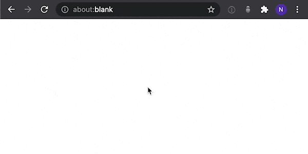

# Podcast Search for Steno.fm

Search for podcasts on Steno.fm from Alfred

## Installation
**<a download href="https://github.com/nathangathright/alfred-steno/releases/latest/download/alfred-steno.alfredworkflow">Download and install the latest release</a>** 

_You will need the [Alfred Powerpack](https://www.alfredapp.com/powerpack/) to enable this workflow._

## Usage
1. Type the keyword `steno` followed by your query to generate results.
2. Press <kbd>⌘</kbd> + <kbd>C</kbd> to copy the steno.fm URL of the selected show to you clipboard.
3. Select a podcast to reveal a list of supported platforms.
4. Select your preferred platform or type its name to filter the list.
   * Press <kbd>Return</kbd> to open the selected result in your browser.
   * Press <kbd>⌘</kbd> + <kbd>C</kbd> to copy the URL of the selected result to your clipboard.

## Limitations
* If a podcast is not listed in the Apple Podcasts directory, it will not appear in search results.

## Credits
* Built with [alfy](https://github.com/sindresorhus/alfy) via [generator-alfred](https://github.com/SamVerschueren/generator-alfred)

## License

MIT © [Nathan Gathright](https://github.com/nathangathright)
